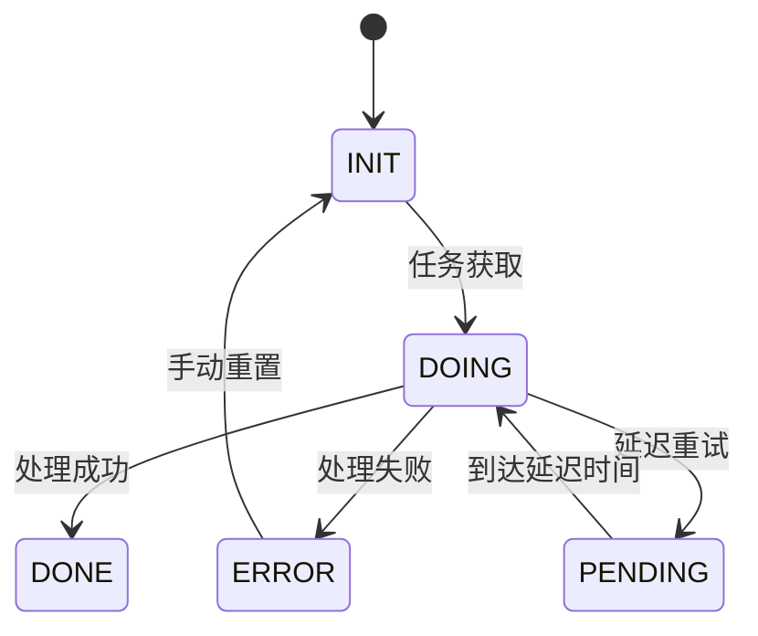

# GORM Async Task Framework

基于GORM的分布式异步任务调度框架，提供可靠的状态管理和弹性任务处理能力。

## 特性

- 🚀 **多状态支持**：INIT/DOING/DONE/ERROR/PENDING 完整状态机
- 🔒 **分布式安全**：基于数据库锁的并发控制
- ⚡ **弹性调度**：延迟任务、批量处理
- 📊 **灵活扩展**：可定制任务实体和业务逻辑
- 🛠️ **简单API**：直观的状态管理接口
- 📈 **监控就绪**：内置任务统计接口

## 快速开始

### 安装
```bash
go get github.com/yourusername/gormasynctask
```

### 基础用法
```go
// 1. 定义任务实体
type MyTask struct {
    gormasynctask.BaseTask
    TaskID    string `gorm:"primaryKey"`
    Payload   string
}

func (t *MyTask) TableName() string { return "my_tasks" }

// 2. 初始化服务
db := /* 初始化GORM连接 */
taskTable := gormasynctask.NewTaskTable[*MyTask](db)
service := gormasynctask.NewTaskService(
    taskTable,
    gormasynctask.RunnerFunc[*MyTask](func(ctx context.Context, task *MyTask, h gormasynctask.Handler) {
        // 业务逻辑...
        h.Done()
    }),
)

// 3. 提交任务
taskTable.Create(context.Background(), &MyTask{
    BaseTask: gormasynctask.BaseTask{TaskState: gormasynctask.TaskStateInit},
    TaskID:   "order-123",
})

// 4. 启动任务消费
go service.Start(context.Background(), gormasynctask.DoInput{
    Limit:       100,
    Concurrency: 20,
})
```

## 核心概念

### 任务状态机


### 处理器接口
```go
type Handler interface {
    // 标记成功（无额外字段更新）
    Done()
    
    // 标记成功并更新字段
    DoneWithUpdater(updater map[string]any)
    
    // 延迟执行（默认字段更新）
    Pending(delayTime time.Duration)
    
    // 延迟执行并更新字段
    PendingWithUpdater(updater map[string]any, delayTime time.Duration)
    
    // 标记失败
    Error(err error)
}
```
